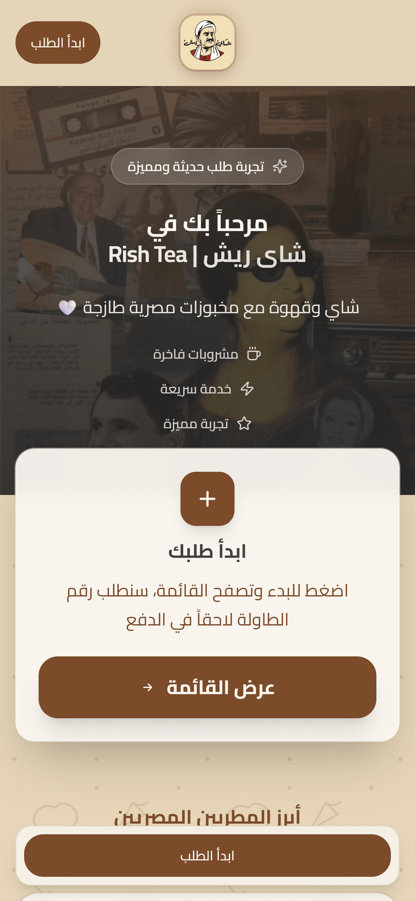
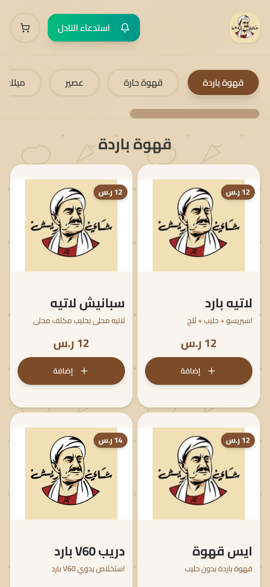
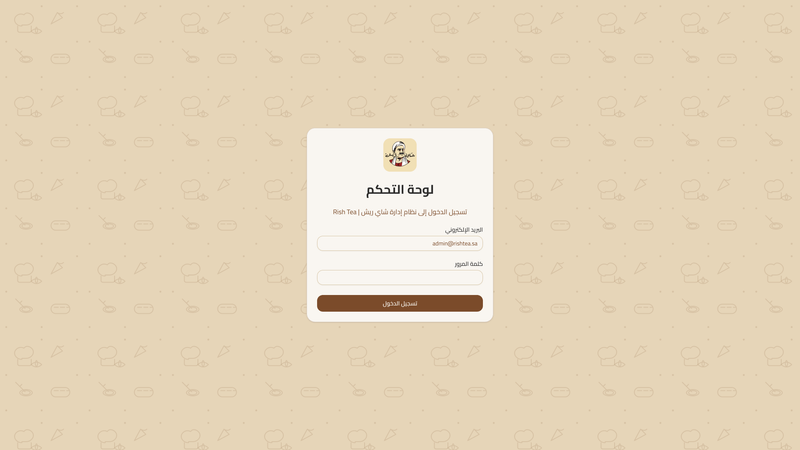
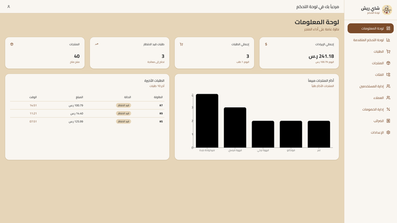
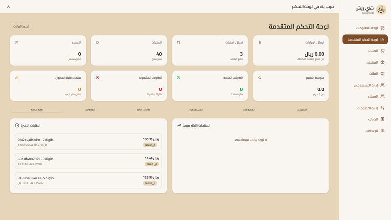
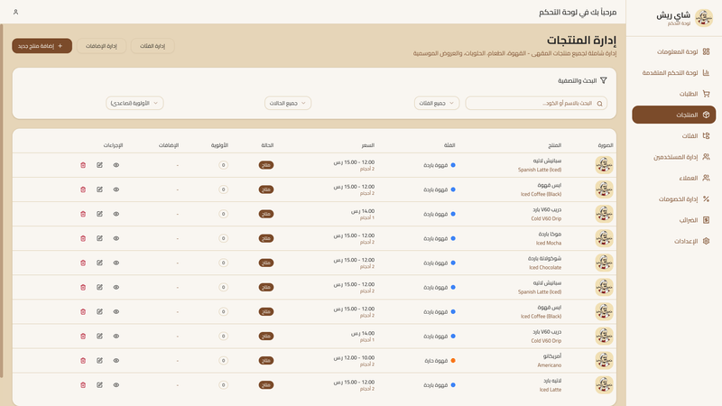
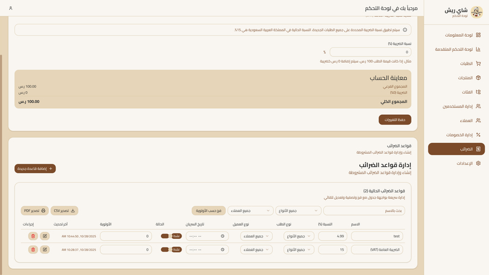

# RishTea

RishTea is a Next.js application delivering a modern café ordering experience with a full-featured admin dashboard backed by Supabase.

## Requirements

* Node.js 18+ and npm
* Supabase project (URL and anon key)

## Quick Start

```bash
npm install
npm run dev
```

Open `http://localhost:3000` in your browser.

## Configuration

Create a `.env.local` file in the project root and set:

```bash
NEXT_PUBLIC_SUPABASE_URL=your_supabase_url
NEXT_PUBLIC_SUPABASE_ANON_KEY=your_supabase_anon_key
# Optional for admin operations
SUPABASE_SERVICE_ROLE_KEY=your_service_role_key
```

Do not commit secrets. See `SUPABASE_SETUP_GUIDE.md` for schema and seed.

## Scripts

* `npm run dev` — start development server
* `npm run build` — build for production
* `npm run start` — run production build
* `npm run lint` — run linting

## Interface Gallery

Screenshots are stored under `public/` in PNG format (exported at 800px width and optimized to be under 500KB each).
In this README they are displayed smaller and side by side using HTML flex layouts.

### 🎥 Demo Video

[Click here to watch the demo](./public/Demo%20Videw.MP4)

[Download demo video](./public/Demo%20Videw.MP4)

---

### 📱 Customer Interface (Mobile)

<div style="display: flex; gap: 20px; flex-wrap: wrap;">

  <div>
    <p><strong>Home (Mobile)</strong><br/>
    Landing experience with hero, warm background, logo, and primary call-to-action.</p>
    
  </div>

  <div>
    <p><strong>Menu (Mobile)</strong><br/>
    Mobile menu view showing product cards, categories, and add-to-order actions.</p>
    
  </div>

</div>

---

### 🔐 Admin Login

<div style="display: flex; gap: 20px; flex-wrap: wrap;">

  <div>
    <p><strong>Admin Login</strong><br/>
    Admin authentication screen with email/password and session handling.</p>
    
  </div>

</div>

---

### 📊 Admin Dashboards

<div style="display: flex; gap: 20px; flex-wrap: wrap;">

  <div>
    <p><strong>Admin Dashboard (Main)</strong><br/>
    Overview dashboard with recent orders, KPIs, and navigation.</p>
    
  </div>

  <div>
    <p><strong>Admin Dashboard (Advanced)</strong><br/>
    Extended dashboard views and enhanced metrics.</p>
    
  </div>

</div>

---

### 📦 Admin: Orders & Products

<div style="display: flex; gap: 20px; flex-wrap: wrap;">

  <div>
    <p><strong>Admin: Order Details</strong><br/>
    Detailed order view with items, statuses, and customer info.</p>
    
  </div>

  <div>
    <p><strong>Admin: Products List</strong><br/>
    Products table with actions to create, edit, and manage inventory.</p>
    
  </div>

</div>

---

### 💰 Admin: Tax Settings

<div style="display: flex; gap: 20px; flex-wrap: wrap;">

  <div>
    <p><strong>Admin: Tax Settings</strong><br/>
    Tax rules configuration, thresholds, and calculation settings.</p>
    
  </div>

</div>

---


## License

See `LICENSE` if present. Otherwise, retain author’s original terms.
